# Red Eye Monitor (REM) Documentation

[About Page](http://redeyemon.sourceforge.net/)

[Sourceforge Project Page](http://sourceforge.net/projects/redeyemon/)

## Overview

### Total Systems Automation

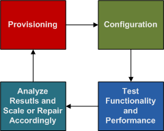

Total Systems Automation (TSA, the good kind), is a new approach to system administration.  The defining different between TSA and traditional system administration is that systems managed under a TSA approach will not require human involvement in any of the normal administration of systems.

Humans will be involved in planning for what the system will look like, how the system will be built, how to inspect how the system is functioning (correctness and performance), what failures to look out for, and how to respond to return the system to a correct and properly performing state.

If a TSA system is build correctly, then as usage of the system increases, the system will automatically respond by adding more machines and resources to accomodate the usage, without human intervention.  Additionally if there are failures in the system, whether invoked by humans (rogue system administrators subverting the TSA system, or attackers) or hardware failures (systems or storage), then the TSA should take steps to automatically correct the problem to immediately return the system to a working state, and alert humans that it is going on in the best ways possible.

A TSA system is not meant to elminate system administrators, it is meant to raise the work the system administrators work on to planning for growth, planning for problems, and planning for how to respond to problems once they have come up, in as many layers deep as seem to be worth trying to fix in an automated fashion.

With the availability of "Cloud Computing" ISPs, such as Amazon, TSAs become available to the public who would normally not be able to maintain a large pool of hardware, and shift broken components out of the working component pool, and have staff to manage them without interfering with their automation of provisioning, configuration, operation, scaling and repairs.

### Cloud Computing vs. Utility Computing

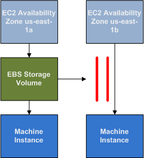

It is worth noting that the service that Amazon and others are providing and labeling as "Cloud Computing", are better understood as "Utility Computing", which is buying computer, network and storage resources in the way you might buy gas and eletricity as a resource.  A centralized provider makes available resources that can be paid for monthly/hourly, as the resource is needed.

Utility Computing seems to very accurately describe what we can purchase from Amazon.  Hourly and monthly payments for machine and storage, as we request, available on request, and terminatable on request as well.

So what is Cloud Computing?  Cloud Computing is much more of a vague concept, but the idea of a "Cloud" leads one to think that it doesnt matter where the resources are, they are "in the cloud", and can move around "in the cloud", so their non-fixed locations seem to be a big factor in thinking about Cloud Computing.

Looking at Amazon's EC2 as Cloud Computing, can we really not care where machines are, because they are "in the cloud"?  No.  Amazon has a number of region based requires, such as Elastic Block Storage (EBS) devices must be in the same Availability Zone (region/data center) as the system instance that mounts them.  On loss of an Availability Zone, or change of requirements for another machine outside that Zone, the storage may not be mounted on another system instance in another zone.  Instead the storage must be snapshotted, and restored as a new EBS volume in the new Zone.

This does not jive with the concept of "things are in the cloud", but aligns very highly with Utility Computing, where we can purchase computing resources in regions, that have their rational corresponding limitations because there are after all running on real pieces of hardware in those regions.

Additionally, Cloud Computing providers, like Amazon, do not currently make all of these things transparent, though that may be their end-goal as they role out new services, but there is a difficult problem of trusting the vendor who provides you with computing resources to also handle all the management of those resources.  All our eggs are in one basket.  It is their responsibility to keep up the resources, their responsibility to come up with a design for making sure they stay available, and their responsibility for tracking everything is working properly.

This is a lot of responsibility for a vendor, and for most companies, will be greater than ever before.

Many companies probably like the sound of this.  Offloading the problem to Amazon, who is clearly good at running their own large website and building datacenters and then selling overage usage to others as an additional business, creates a complete and total dependency on Amazon for your business.

However, Amazon only cares about your business functioning as a result of wanting payment for the resources, and good PR for others to pay for their resources.  Their interest in your businesses continuity ends there, and they are not liable nor do they indemnify you for failures in running your system, that is your business.

This is not a negative that is so overwhelming as to discourage anyone from using Cloud Computing vendors, it should merely be understood as one of the risks.  Just as there are risks in having a single data center provider, it is a factor of how much money your operational uptime and responsiveness is worth to your business.  If it is not worth the money to care about Amazon's outages and gaps in their operational plans, as they relate to our operations, then 100% investing in their solutions may be a viable strategy.

If our operations are more important to us, and outages at the hands of vendors are not acceptable, then more needs to be done.  Utility Computing is extremely useful, but does not provide the free-flowing goodness we expected when things are "in the cloud", and just seem to magically work.

### Cloud Computing vs. Service Centric Total Systems Automation

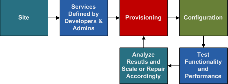

Since Cloud Computing is not very well defined, and has an air of hand waving about it, it makes for great journalism and water cooler discussions, but is a poor marker for coming up with concrete plans to use Utility Computing resources.  Additionally, very few large organizations will work solely in the cloud, or should for a number of reasons.

Also, using any single cloud vendor, like Amazon EC2, while they are good enough to be a primary cloud computing resource, leads to being locked in and caught whenever they have wide scale problems, come under siege from massive hacking efforts, does not allow competition on price, resources or support, resource shortages from popularity, and many more potential problems.  A robust cloud computing plan should include having multiple cloud vendors, to ensure the ability to scale resources when your primary vendor is failing to meet your requirements.

Mixing in privately owner, non-cloud vendor resources, and treating them like they were also cloud resources, but with the benefit of being physical hardware that can be managed exactly as you wish, with the performance characterists you can specify through explicitly purchasing would be a powerful addition to a cloud computing environment.

This is the goal of a Service Centric system, where the goal of the system is to provide defined services, that can run on a number of different resources, both local to your offices, in rented data center space, leased machines in data centers, and from multiple cloud vendors.

The definitions of the services will determine which resources are assigned, in each location, to provide the service your users and applications require.

Combining this with a TSA system allows comprehensive planning of how to use these different pools of resources, how to combine them together, and take into account the variety of problems with security and data migration, backups, monitoring, failure response, and automated scaling.

This is the goal of the Red Eye Monitor (REM) system.  To provide a method of defining the goals we want to provide in services, and then through a combination of owned/leased physical hardware in various regions, and rented virtual resources from various vendors in various regions, to fufill your organizations needs in a planned and automated fashion.

This is not magic, and requires a greater deal of up-front work and planning, so whether you wish to embark on this system will come down to how you would like to approach your work.

The difference between them is that a TSA system starts off automated from the beginning, and is always an automated system.  A non-TSA system starts off manually or semi-automated, and will likely always require a good deal of manual or automation updates, as the ecosystem changes many of the automations will no longer work, and will need to be redone.  With a TSA system, change is expected and planned for, so the general automation of the system never changes, only new hardware types need to be wrapped, and new business goals to be planned for, and additional levels of failure response automation can be added as it is deemed worth the trade off.

A TSA system should lead to a much easier system to scale and manage, and will adapt to changes with minimal effort, but is requires significantly more expertise and work to initially configure.

## Hierarchy

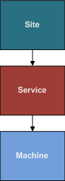

The REM system is a hierarchy, where everything springs forth from a Site, which allows a single REM installation to handle many seperate systems, which can either interact with each other, or remain completely seperate.  User access can be different between these Sites so that they be managed seperately, while still retaining authoritative information about each other.

One important hierarchy is the Hardware Computer to Service Connection hierarchy.  This hierarchy covers everything from the physical hardware or virtual data ceneter (like Amazon's EC2) that creates machine instances to the services and connections between services that make user and application transactions possible, and the outputs and storage requirements and maintenance of those services.

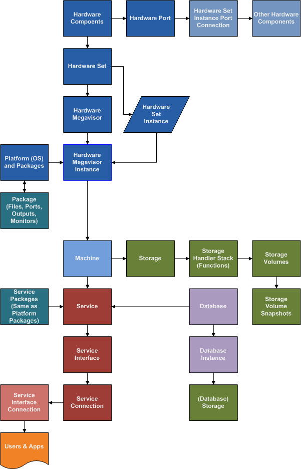

### Hardware Components

A hardware component is either a physical or logical (virtual) element that we care about in terms of providing a system, storage, network, power or other resource.

Physical examples included a hardware chassis, power supply, motherboard, CPU, RAM sticks.

Virtual examples could be as simple as an all-encomassing generic hardware component that may wrap all of a virtualized machine vendor, like Amazon's EC2, so that all functions for creating system, storage, floating IPs, load balanced addresses and other resources would come from a single virtual hardware component.  Or, many virtual components could be created to give a sense of the different aspects of the virtual data center's resource creation.  This is especially useful if they have a number of resource information to track, such as remaining machines of various types, or storage, in a particular region or data center.

Hardware components have a parent, which is the hardware which they belong to.  For a system, the parent resource would typically be a chassis, which would contain children like power supplies, a motherboard, disks and fans, among other root level children that might live in a chassis.

Then the motherboard would contain children of the CPUs and RAM sticks.  Saving each stick of RAM as a child of the motherboard has the advantage of being able to monitor each stick, and be able to record how it is functioning, ECC error rates and other information, and will aid in diagnostics of hardware when hardware maintenance is required.

Each element of hardware that is important to monitor or confiured should be accounted for as a seperate element, so it is can be tracked independently and our data closely models reality as is useful.

If a Hardware Component has an external shell, and this corresponds to it's rack space usage, it is given a Rack Unit height value.  All chassis' would contain a Rack Unit (RU) height, for the space they take up when mounted in a rack.

### Hardware Ports

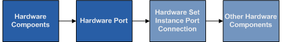

One important aspect of hardware is that components connect together to other components, both inside the same hardware set (such as disks to the drive controller) and to other hardware sets (such as NICs to switches, PSUs to power strips, Fibre Channel to SAN switches, etc).  Instead of making these hardware components, ports are special and attach to hardware components, but are considered seperate.

Hardware ports specify a type (like 110 Power, RJ-45, Fiber Channel or DB9), and whether they are a provider, consumer or bi-directional, to assist us in understanding which port is providing power and which is consuming power, or which is prodiving the source KVM signals, and which source is consuming KVM signals to pass on to a remote user.

### Hardware Set

A Hardware Set is the sum of all the components and ports that are under the root hardware component, such as a system chassis, which include's the systems power supply, the port the power supply receives it's power from, the motherboard, CPUs and RAM on the motherboard, the drive controller (if considered a seperate component from the motherboard), and it's ports that will connect to the disks that are children of the chassis.

The Hardware Set is a specification for a certain make and model of hardware, like a Dell 2850 server, or a specific Cisco 5000 series switch.  Each different configuration, whether it has a different RAID card, or more RAM, should have it's own Hardware Set.  Duplicating previously specified should make minor configuration changes easy, and we typically want to try to minimize variances in hardware specifications anyway, so this method encourages thoughtful use of different hardware configurations as the differences of maintenance and work involved to support more configurations is made more obvious, and when desirable the correct path for automating each varient properly is encouraged under the REM system.

Functions are written against this Hardware Set, as everything in this hardware set is fixed, so functions are not needed to be written against a specific component or port, which would be over-designed.

When similar Hardware Sets can share code, the scripts can simply be duplicated without change, but all Hardware Sets actually have their own functions, because no absolute compatibility exists between any two different specifications of hardware, as a single difference in RAID controller versions could break many functions that rely on one implementation and do not work with the other.

### Hardware Set Instance

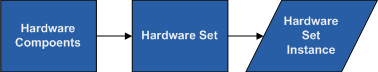

A Hardware Set Instance is the first usuable data construct in this hierarchy so far.  Before this, things have been specified in general, but this is a unique instance of a specified set of hardware components and ports.

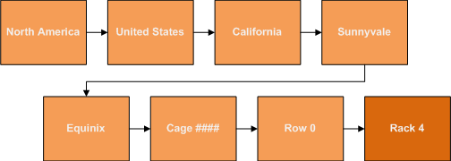

A Hardware Set Instance has a Location, which is hierarchically specified (North America, California, Sunnyvale, Data Center, Cage Number, Rack Row), and then given a Rack Unit height from the bottom of the rack position being RU0.  So a Hardware Set Instance may be positioned at RU20, half-way up a rack, and it's root Hardware Component, a chassis, has a 10 Rack Unit height value, so the Rack Unit area between RU20 and RU30 is taken up by this Hardware Set Instance.

### Hardware Set Instance Port Connection

When connecting ports to other ports (always the case), the Hardware Set Instance must be used, as it is the actual device with the actual ports that connect to some other actual device's actual ports.  These could be virtual, and this could be useful in describing how network peering arrangements are set up, where third party network sources are created as virtual Hardware Set Instances, and their ports connect to the demarcation ports of our equipment, or the equipment of our vendors that we are aware of and care about tracking.

Because ports specify whether they are a provider, consumer or share resources bi-directionally, then a dependency graph can be created for monitoring and alerting purposes, as well as capacity planning and as sources to collect information against when monitoring and graphing, and in the case of networks is important for double checking network usage bills.

### Hardware Megavisor

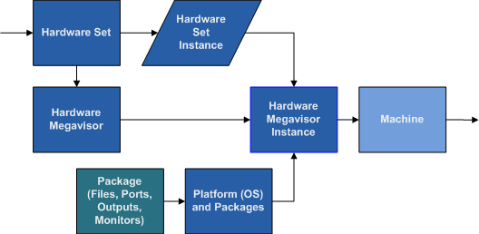

This is an abstraction as a method for how to interface with a Hardware Set.  The Megavisor sits on top of any other kind of management for the hardware, so if a hardware hypervisor exists for creating virtual instances (like the IBM Blade LPARs), the Megavisor controls the hardware hypervisor.  Similarly if hardware has a software hypervisor (like VMWare's ESX or Xen), the megavisor also manages this to create trackable instances.  Finally if hardware is simply raw hardware, the megavisor controls this the same way.

The Megavisor is simply a wrapper for named scripts, Functions, that control a specific Hardware Set.  A Hardware Set may have more than one Megavisor that could control it, if different scripts provide a different kind of functionality.  This will be more useful on a regular basis for creating a new version of a Megavisor, so the old version still functions on instances it controls, while the new Megavisor set of Functions is being tested, and then instances are migrated to it.

REM is designed to be upgraded, so every area works to provide mechanisms to go through development, QA, staging and finally make it into production, both for REM control scripts and changes, and for the actual operation environment, since both are critical to a smooth running operation.

### Platform

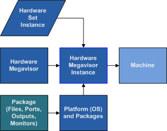

A platform is basically an Operating System version.  This is a label for a specific brand and version of operating system, or different builds and patches of an operating system.

As software is updated, patched, or modified, new platforms will be created so that they can be tested, approved for production, and finally machines can be brought up in production usage with the newly certified platform.

### Platform Package

Packages are the same no matter how they are categorized or installed.  All packages contain a sequence of things to install, by type (like an RPM, checking our of a source control like Perforce or SVN, or less desireable ways like rsyncing or copying from a network location like an HTTP or FTP server), and the installation path.

Packages that installed on a platform are the basic packages required to boot up the operating system, control the devices (like storage and network), and do basic client services (like DNS, mail client, and mount network storage).

Packages that provide services (like NFS servers, web servers, application servers, central account management, etc), will be the same kind of package but should be listed as a Service Package, not a Platform Package.

Packages also list all their inputs and outputs.  If a package, like Apache, listens on a TCP port for the HTTP protocol, with a default of port 80, then this is specified in the Package Interfaces, as a Incoming Transaction Interface (bidirectional communication, listening for connectors).  Additionally if a package writes to a log file, an output Interface is created, that specifies the destination path default, and default rotation, retention delays (local and global), and backup frequency, so that all output is also going to be dealt with in a way that takes care of local (local disks) and global (long term storage) resource constraints and cost.

Packages also specify what Connections they make to other Package Interfaces.  For an example, a Syslog Client package has a Connection that is made to a Syslog Server Interface (UDP or TCP Listening Message Interface).

Different kinds of Interfaces are:

- **Transaction:** Information is sent from the connector to the listener, and the listener responds back with data.  HTTP is transactional.
- **Message:** Information is sent from the connector to the listener, and only response data for success or failure is returned.  SMTP is Message.  Logs are message (one line being written at a time), same with Syslog.
- **Resource:** A resource, like a Virtual Private Network (VPN) is provided.  This is not really transactional, and thus useful to seperate.
- Others?

Package functions also contain everything needed to configure a machine so the package's system services can automatically start up (such as Apache's httpd service), and how to start, stop, restart, reload configuration files and refresh rotated log files, or any additional control features such as clearing queues, reseting server components, or whatever other administration tasks are needed for the installed contents to actually function on the machine.

For a package, whether Platform Package or Service Package, to have it's executables actually do anything over a network a Service needs to be defined which mounts the package (Services can mount Service Packages or Platform package's Interfaces) interfaces as Service Interfaces, which will then allow configuration of a machine resident firewall (like iptables) to lock down any incoming connections to only those specified in the Service mounted packages, so that packages do not listen to actual wire traffic unless the Service definition explicitly states that they can, and how.

### Hardware Megavisor Instance

A Megavisor Instnace is the combination of a Hardware Set Instance, and a Platform.

This gives us our first concept of a distinct system element that we can use.  It is a specific megavisor instance, so has computing and memory resources, and some sort of storage that could take the Platform operating system and packages.

This is a fairly thin layer of abstraction, but important as it is where all the distinct pieces come together to wrap any kind of virtualization that happen at a lower level.

### Machine

The Machine is the full concept of a system.  At this point all other aspects, such as what Operating System it runs, whether it is a physical machine or a virtual instance, whether we own the hardware or are renting it from a vendor have all been abstracted away.  This is merely a machine resource that has a certain amount of CPU power, memory, and is running on the network with very basic services set up, and is completely locked down in terms of any incoming network connectivity.

A machine without any Services on it should be maximally locked down, only connecting out to send it's routine administration mail, syslog events, and any backups of log files for the basic system functioning.

Monitoring is also enabled, which is the only exception for the un-configured machine.  If the REM system knows about it, it is being monitored to make sure it is still functioning as it should be.

### Storage

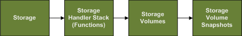

Storage is the encapsulated sum of everything needs to manage the physical or virtual elements, whether local or remote, that allow us to mount a device, or series of devices, onto a machine and ultimately onto the file system path for writing files, or not file system mounted if raw device usage is preferred.

The number and type of the volumes and the functions to manage those volumes are wrapped in the Storage Volumes and Storage Handler Stack, respectively.

### Storage Handler Stack

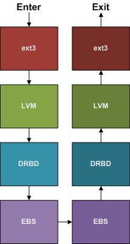

Every Storage has a Handler Stack, which is a hierarchy of Storage Handler's, which are named sets of Functions, such as for the ext3, XFS, ZFS or JFS file systems, or the DRBD network RAID 1 layer, the Linux or Veritas Volume Managers, and local or Amazon Elastic Block Storage (EBS) or SAN mounted volumes.

A Storage Handler Stack for an Amazon EC2 machine might look like this:  **EBS -> DRBD -> LVM -> ext3**.

This means an EBS volume has been created and assigned to the machine, then a DRBD network RAID1 layer was created on it to keep it in sync on another machine, then the Linux Volume Manager was assigned to freeze and unfreeze volumes, and ext3 for the file system.

When running any functions over Storage, which is how things are done with Storage, functions are called in order, first from the top of the stack (ext3) to the bottom (EBS), and then back from the bottom (EBS) to the top (ext3), as all Storage Handler Functions have both an Entry Function and an Exit Function.  This allows atomic operations on Storage, taking account many operations that may need to happen for each layer in the Storage Handler Stack.

For exmaple, to run a Snapshot command on the EBS volume these would be the steps for the above stack:

1. **ext3 Entry:** Nothing.
2. **LVM Entry:** Freeze the LVM volume, so all writes and reads block, and the snapshot will be consistent.
3. **DRBD Entry:** Nothing.
4. **EBS Entry:** Snapshot, waiting for it to complete.
5. **EBS Exit:** Nothing.
6. **DRBD Exit:** Nothing.
7. **LVM Exit:** Unfreeze the volume, so all writes and reads resume, with the snapshot having been taken in a consistent state.
8. **ext3 Exit:** Nothing.

In the way, everything from Requesting (for EBS or SAN controller devices), Configuring (creating connecting devices, formating), doing Snapshots or backups, Diagnostics or any other device related operations can be performed.

### Storage Volumes

A Storage Volume is the individual volume that makes up the final Storage.  Many volumes may be used in a RAID configuration, and with spares, or any other kind of configuration that the Handler Functions will wrap.

The Storage size is the final device size for the storage, after all the work has been done to configure it for use.  Storage Volume size is the raw size of this storage before it has been configured for use.

### Storage Volume Snapshots

Backups of volumes.  Will be done all at the same time, and consistently, if set up and scripted properly, so that a complex Storage made from many Volumes will always be able to be recreated from the last snapshot if it fails it's correctness or functionality tests.  If the restore from Snapshot fails, earlier Snapshots can be used until one passes and the Storage can return to use.  How to handle this is up to the implementor's scripts.

### Service

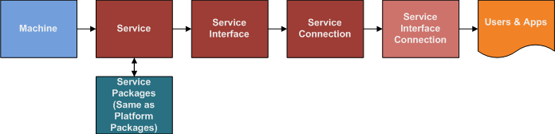

The Service is the most important concept in REM.  A Service defines everything a class of machine will need to do to perform it's job.  This includes:

- What Service Packages are required to install, prepare for configuration (once all the Service's Interfaces and Connections have been aligned), and finally configure (against all machines in the Service and it's connected Services).
- Which Packages (Service and Platform) have interfaces that will be exposed outside the running Machine.  These are done with Service Interface Mounts, which specify the Package Instance (specific package on the specific Machine, to track it's install and operational status, including monitoring functionality and performance).
- Which Service Interface's this Service has Connections to.  This creates a Service Connection, which is specifies a running Service that attachs to another running Service, in the same deployment (Dev, QA, Staging, Production) and provides a way to track movement through Security Zones which every Service has specified.
- Monitors always run against any installed Package, and results are aggregated between all the Machines running a Service so that the total performance and functionality of a Service can be seen on individual machines, and accross the service as a whole.  Degradation of service is tracked as well as total serviceability.

Any given Machine is only serving one Service, which, on top of the basics of the Platform, specifies all the things that need to be installed, as also how they connect with other services, so that all configuration files can be automatically filled with template data, as long as the configuration files are properly formatted with REM Service Interface and Connection Template Formatted variables.

Services are versioned, with "parent" Services as earlier versions of themselves, so any changes go through the deployment process (Dev, QA, Staging, Production), so no Service changes result in downtime once it is finally being Canaried into Production, Service Levels can be applied to see if too large of a performance degradation is present, even if the functionality is correct.

### Service Package

See Platform Packages for a description of a Package.  This Package is just defined for the Service, which is the specific type of Machine, by function, instead of in Platform, which is the operating system and basic client and driver Packages.

Like Platform Packages, these Service Packages have all the Interfaces and Connections specified inside them, and they will be monitored, and logs rotated and retained for the specified time, and backups created, even if they are not mounted by the Service to be connected to other Services.

Once the Interfaces and Connections have been specified in the Service, for the given Packages, then the Machine can have the mounted ports made available in the Machine resident firewall.

### Service Interface

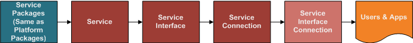

A Service Interface takes a Package on a machine, whether it is a Platform Package or Service Package, and maps the Package Interface to a Service Interface, which is named and is the target of a Service Connection.

The Service Interface represents a way to allow incoming network traffic to the Service Machine, and allows dependency graphing of all of our Services, for Alert Suppression, so that the supplying Service is known to be a dependency for receiving Service.

### Service Connection

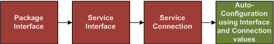

This is an outgoing connection from a Service on the running machine, to another Service (probably on another Machine, but not enforced).

Between the Service Interface and the Service Connection, we can populate our configuration files with REM Template Formatted Variables which will be automatically populated with the data specified in the named Service Connections and Interfaces, so that configuration is always correct, and Services can be re-organized in their specifications, and configurations will remain properly configured.

### Service Level

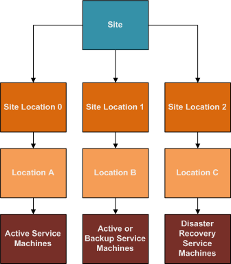

Service Levels deal with the amount of Machines running for a particular Service, in a particular Location.  Locations may need different amounts of Machines to provide the best service at the best price point, as well as different Machine requirements (Hardware Sets).

A basic Service Level might be "Minimum of 5 Machines in Site Location 0", or "Maximum of 50 Machines in Site Location 0".  These would ensure there are always at least 5 Machines in a Site Location 50.

Location's are abstracted by order of preference, as Site Locations.  Site Locations have an order of precidence which is used for specifying the Location order, so that given Location A, B, and C, they can be ordered:

- Site Location 0 = Location A
- Site Location 1 = Location B
- Site Location 2 = Location C

This means we could say there are:

- Minimum of 5 and max of 50 in Site Location 0
- Minimum of 1 and max of 50 in Site Location 1
- Minimum of 0 and max of 50 in Site Location 2

Now if Location A has a catastrophe, such as loss of power to the data center, we can re-order the Site Locations like such:

- Site Location 0 = Location B
- Site Location 1 = Location C
- Site Location 2 = None

And so 5 Machines would be created in Location B (Site Location 0) and 1 Machine would be created in Location C (Site Location 1).

If Location A comes back, it could be set to Site Location 2, and no Machines would be created or removed, or it could be re-inserted into Site Location 0, to restore the original order.  This would add 5 Machines to Location A, and remove 5 Machines from Location B, and remove 1 Machine from Location C.

In this way we can deal with losses of Locations for disaster recovery, as well as specifying different rules for how to scale in a given Location.

Minimum and maximum Machines is a very simple Service Level case.

More interesting cases would be for a Service Level will be directed at the duration of a HTTP monitoring request for a specific Service Interface (specified against the Package RRD Field, with a Monitoring Rule).  If the duration of this HTTP request is over the given amount, such as 50ms, then more Machines should be added to the Service in the specified Site Location, based on the Service Level Rate Change Rules (to ensure increases or decreases are not performed too rapidly, which may cause service interruptions).

## Monitoring, RRDs, Graphing, State, Alerts, and Triggers

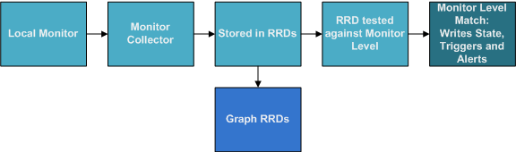

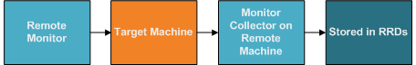

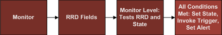

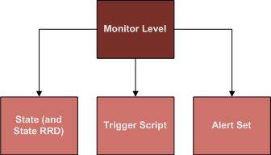

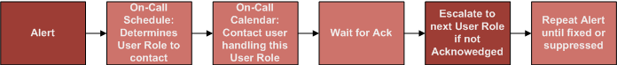

*To be continued...*

## Database

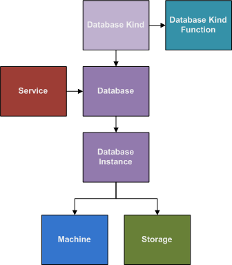

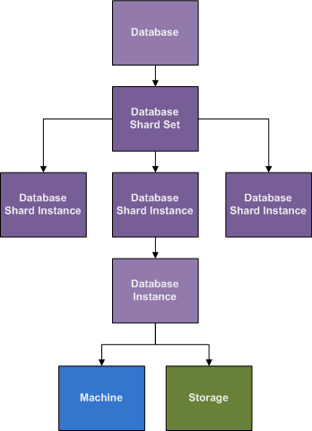
